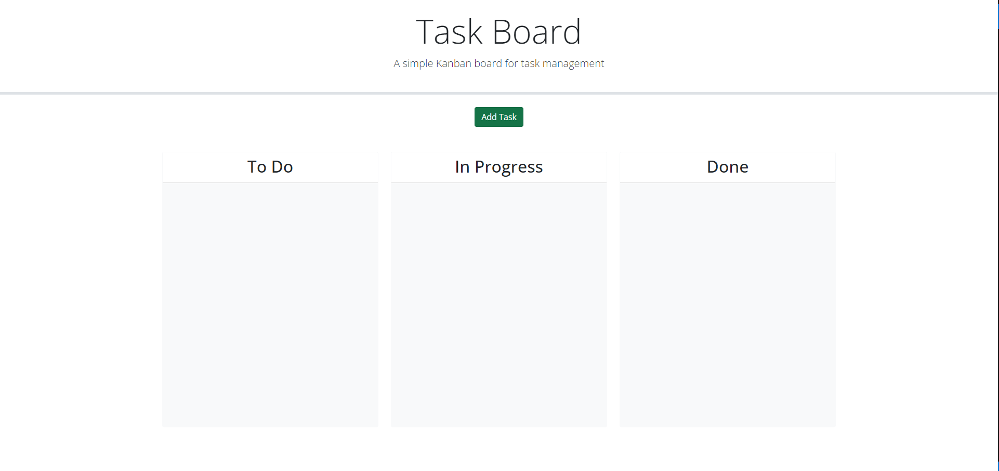
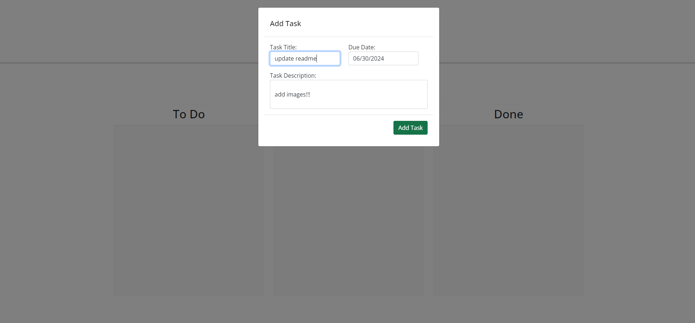
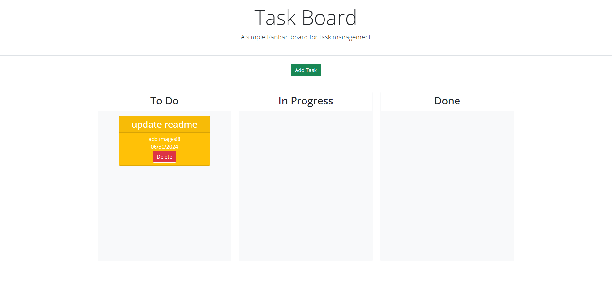
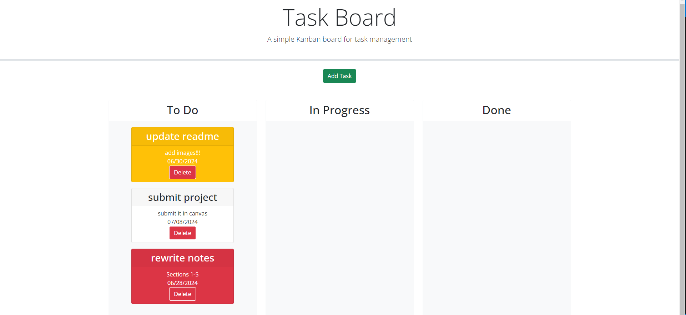
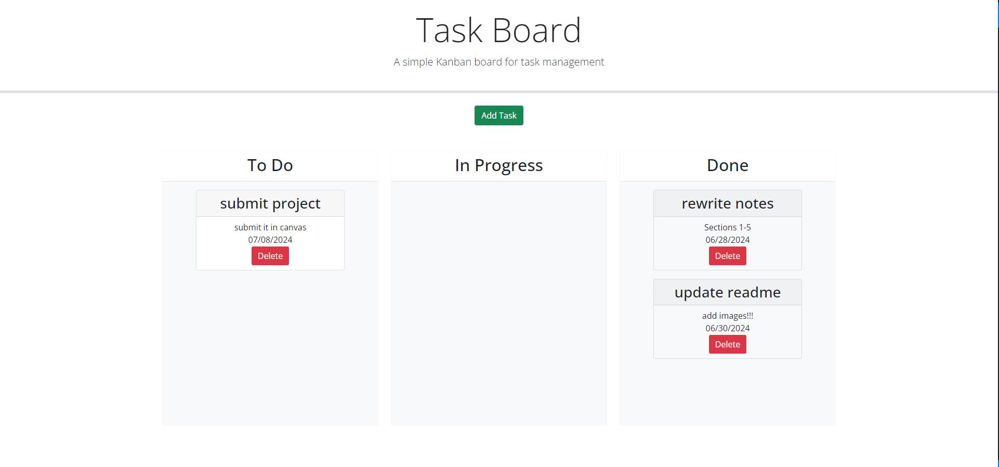

# Simple Kanban Task Board

## Description

This is a simple task board that can be used to keep track of assignments, their due dates, and their completion status. I built this in order to gain familiarity and practice with Bootstrap, JQuery, and third-party APIs in general; in particular, this project gave me the opportunity to learn about JQuery's draggable and droppable classes, as well as the Day.js API. It also allowed me to obtain more practice saving and retrieving objects to local storage via JSON files, and using said objects to manipulate HTML elements (and vice versa). Importantly, this exercise was also a practice in finding and applying documentation for unfamiliar APIs, which is a valuable skill for any programmer.

## Usage

To use, go [here!](otekolste.github.io/task-board)

When you load the page, you will see an empty task board with 3 columns. Click "Add Task" to get started. 

When you do so, a form will pop up in a modal with three fields for you to enter. Note that the "due date" field will allow you to pick the date from a calendar!

When you click "add task", the modal will disappear, and a card will be created for your task! 

The task cards will display the title, due date, description, and a delete button. The cards are also color-coded: red means it is overdue, yellow means the due date is within a day, and white means there are more than 2 days until it is due, OR that it is complete. 

You can drag and drop the cards into the different columns to designate whether they are in the backlog, in progress, or complete. If you try to drag a card to a spot outside of the 3 columns, it will snap back to its original location. If you drop an overdue or near-due task into the "done" column, its color will change to white. The positions of the cards will also be saved if you refresh the page, or close out of the page and return later.

The task cards also each have delete buttons; deleting a task will remove it from the page permanently.

## Credits

Base code provided by edX, through UNC Chapel Hill.

## License

License is available to view in the root of the directory, entitled "LICENSE".

